# The Rise of AI Agents

## 1. Introduction to Artificial Intelligence (AI)

**Artificial Intelligence (AI)** refers to the simulation of human intelligence in machines that are programmed to think, learn, and make decisions. At its core, AI enables systems to:

- **Perceive** their environment through data input (text, images, audio, sensors).
- **Reason** by interpreting information, identifying patterns, and making inferences.
- **Act** by taking decisions or executing tasks autonomously.

### Why AI Matters

AI is transforming every sector—healthcare, finance, manufacturing, education—by automating complex tasks, improving decision-making, and enabling new forms of creativity. Its progression over the past decade has been driven by advances in:

- **Data availability** – massive datasets for training.
- **Computational power** – GPUs, TPUs, and distributed cloud systems.
- **Machine learning algorithms** – deep learning, transformers, and reinforcement learning.

From basic predictive analytics to autonomous, reasoning-driven agents, AI is evolving into a foundational technology for the global economy and society.

### Types of AI (By Capability)

1. **Narrow AI (ANI)** – Specialized systems built for a specific task, e.g., chatbots, image recognition, recommendation engines.
2. **General AI (AGI)** – A theoretical form of AI with human-level reasoning and adaptability across domains.
3. **Superintelligent AI (ASI)** – A speculative future stage where AI surpasses human intelligence in every aspect.

### Types of AI (By Functionality)

- **Reactive Machines** – Respond to inputs without memory (e.g., early chess AIs).
- **Limited Memory** – Learn from historical data to make predictions (e.g., self-driving cars).
- **Theory of Mind** – Understand human emotions and intentions (research stage).
- **Self-Aware AI** – Possess consciousness (purely hypothetical).

## 2. The Evolution of AI

AI has progressed in **distinct waves**, each expanding the scope of what machines can do:

1. **Predictive AI** – The first modern wave of AI focused on analyzing historical data to forecast future events. These models powered applications like demand forecasting, fraud detection, and medical diagnosis.

   - **Core Ability:** Pattern recognition and statistical prediction.
   - **Impact:** Enabled _data-driven decision-making_ across industries.

2. **Generative AI** – The second wave brought systems capable of creating original content—text, images, audio, code, and even video. Powered by large language models (LLMs) and diffusion models, generative AI transformed creativity and content production.

   - **Core Ability:** Synthesizing new data from learned patterns.
   - **Impact:** Empowered individuals and businesses to produce high-quality content at scale.

3. **Agentic AI** – The current and emerging wave, where AI systems are not only generating but also **acting** autonomously. They can plan, make decisions, interact with digital/physical environments, and improve through iterative learning.

   - **Core Ability:** Autonomy in action and adaptive decision-making.
   - **Impact:** AI evolves from a tool to a proactive collaborator, managing complex tasks with minimal human oversight.

### Visual Overview: The Three Waves of AI

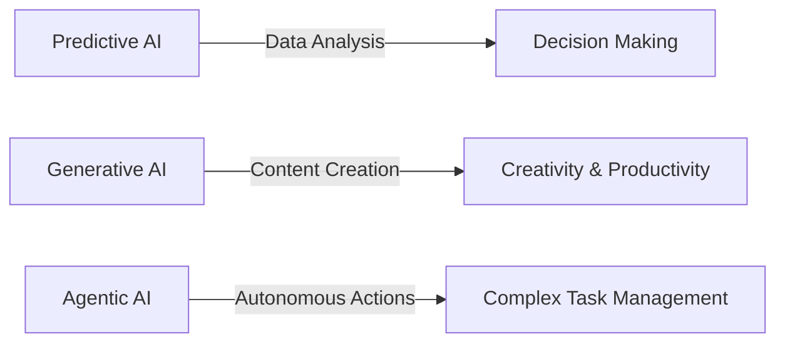

### Timeline of AI Waves & Key Breakthroughs

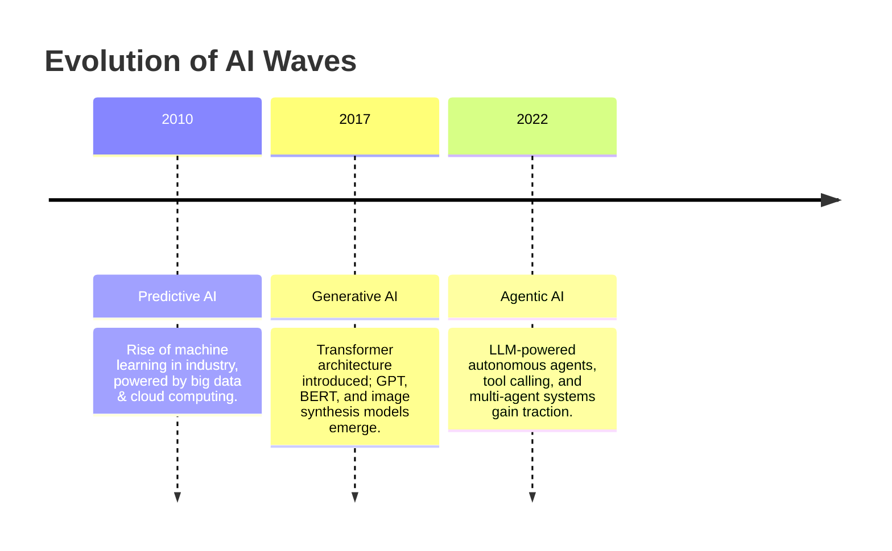

## 3. Foundations of Modern AI

This section builds the technical foundation for understanding **Agentic AI**. It covers the lifecycle of AI models, the fundamental scaling laws, neural networks, GPU acceleration, and the shift from rules-based software to learned models.

### 3.1 The Two-Step Lifecycle of AI Models

AI models operate in two main phases:

1. **Training** – Teaching AI to understand language, patterns, or tasks by exposing it to vast datasets.
2. **Inference** – Using the trained AI to generate responses or make predictions.

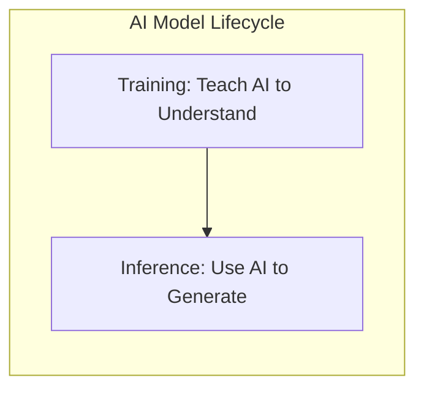

### 3.2 Two Fundamental Scaling Laws

- **Training Scaling Law:** Performance in large language models (LLMs) improves with increases in:

  - Model size (parameters)
  - Training data volume
  - Computational resources

- **Inference Scaling Law:**

  - Intelligence requires reasoning — the more compute during inference, the better the quality of the answer.
  - Trend: from massive pre-training clusters toward **inference clouds** — distributed, cloud-based inference servers.

### 3.3 Neural Networks — The Brain of AI

- **AI thinks like our brains.** Neural networks mimic the way neurons in the human brain connect and transmit signals.
- Each "neuron" is a small computational unit that communicates with others, forming layers of understanding.
- These networks enable AI to recognize images, understand speech, and learn from data.

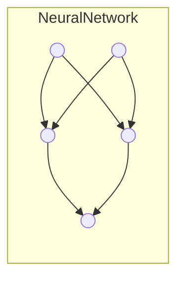

_Illustration: Input Layer → Hidden Layers → Output Layer._

### 3.4 GPUs — The Muscles of AI

- **Parallelism:** GPUs process many tasks at once, unlike CPUs that process one at a time.
- **Impact:**

  - Accelerates training and inference by up to **100x**.
  - Enables large-scale AI model experimentation and deployment.

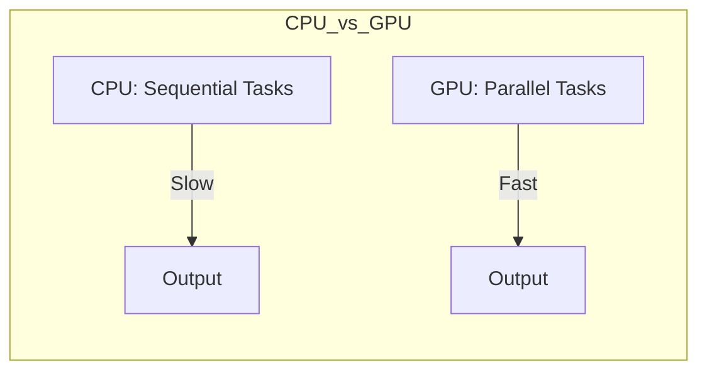

### 3.5 Software 1.0 vs Software 2.0 — From Rules to Learning

**Software 1.0 (Rules-based):**

- Humans write explicit rules.
- Program applies these rules to inputs to produce outputs.

**Software 2.0 (Learned Models):**

- We give inputs and outputs; the system learns the rules automatically.
- Models adapt and improve as data grows.

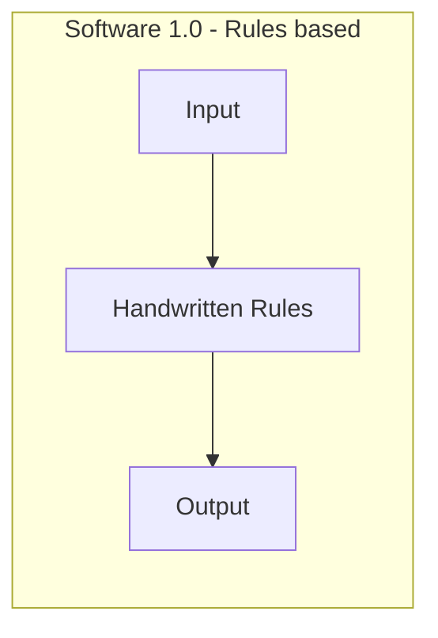

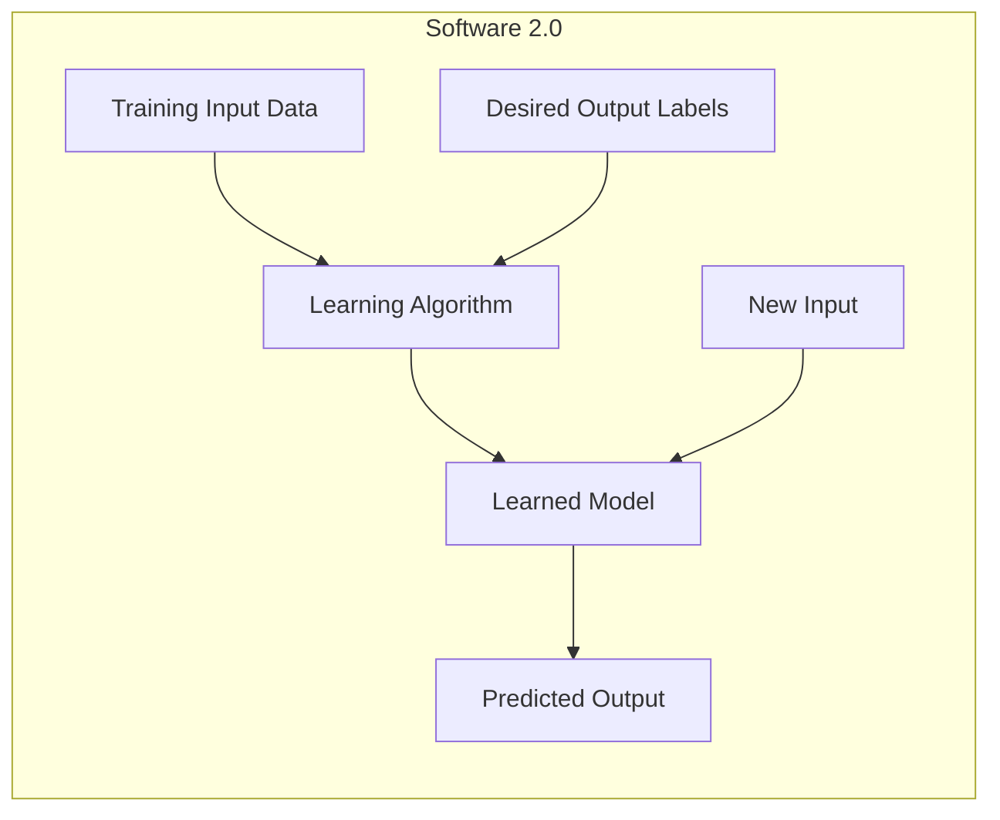

## 4. Road to AGI – From Chatbots to Agentia World

Artificial General Intelligence (AGI) isn’t an overnight leap — it’s a progression through increasingly capable stages.
**OpenAI’s vision** (as reported by Bloomberg) outlines five key milestones on this journey:

| **Level**   | **Stage**     | **Description**                                                     |
| ----------- | ------------- | ------------------------------------------------------------------- |
| **Level 1** | Chatbots      | AI with conversational language, able to respond and assist.        |
| **Level 2** | Reasoners     | AI that can solve problems at human level.                          |
| **Level 3** | Agents        | AI systems that can take autonomous actions in the world.           |
| **Level 4** | Innovators    | AI that can assist in invention and creative breakthroughs.         |
| **Level 5** | Organizations | AI that can perform the coordinated work of an entire organization. |

### Why This Matters for Agentia World

Agentia World represents **Level 5** in this roadmap — the stage where AI systems don’t just respond or act individually, but operate as **fully integrated, intercommunicating entities** across domains.

By aligning with this framework, we can clearly see:

- **Where we are now** – Most of today’s systems are between Levels 2 and 3.
- **Where we’re going** – Agentia World envisions the leap to Level 5.
- **Why DACA is essential** – To reach Level 5, we need the **scalable, resilient, and portable** architectures DACA provides.

## 5. Understanding Agentic AI

Agentic AI represents a transformative leap in artificial intelligence — shifting from passive models that merely respond to prompts, toward autonomous entities capable of **goal-driven reasoning, planning, and action**.

### 5.1 What is Agentic AI?

- **Traditional AI models**: Primarily reactive, providing outputs based on direct inputs without independent goal-setting or environmental interaction.
- **Agentic AI**:

  - Possesses the ability to perceive, reason, and act.
  - Operates within a broader environment, making decisions and executing tasks with minimal human intervention.
  - Integrates multiple capabilities such as planning, memory, and tool usage to achieve objectives.

### 5.2 Core Characteristics

1. **Autonomy** – Operates without continuous human oversight.
2. **Goal-Oriented Reasoning** – Works toward defined objectives.
3. **Adaptive Planning** – Adjusts strategies based on real-time feedback.
4. **Multi-Step Execution** – Handles complex tasks involving multiple operations.

### 5.3 Tool Calling: Extending the Agent’s Reach

**Definition:**
Tool calling enables AI agents to autonomously select and utilize external tools or APIs to accomplish tasks beyond their inherent capabilities.

**Significance in Agentic AI:**

- **Enhanced Problem-Solving** – Allows AI to tap into specialized resources such as databases, computational engines, and third-party services.
- **Dynamic Decision-Making** – Supports real-time data retrieval and processing for better-informed actions.
- **Expanded Functional Scope** – Equips AI agents to perform complex, multi-step operations that combine reasoning with action.

**Example Scenario:**
An AI agent planning a trip could:

1. Access flight booking APIs.
2. Query hotel reservation systems.
3. Pull event schedules from local databases.
   Result: a fully optimized itinerary without manual intervention.

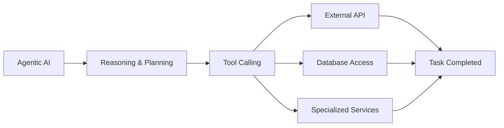

### 5.4 Why This Matters

By combining autonomous reasoning with the ability to access external tools, Agentic AI transcends the limitations of static models — paving the way for AI systems that can operate as **self-sufficient digital collaborators**.

## 6. The Vision: Agentia World

Agentia World represents the **pinnacle of AI evolution** — a Level 5 stage in the AGI roadmap where AI systems function not just as isolated tools or agents, but as **fully orchestrated, intercommunicating entities** capable of running complex, multi-domain operations with human-level coordination.

It’s not about one powerful AI; it’s about **an ecosystem of specialized AI agents** that collaborate, delegate, and self-organize to achieve large-scale objectives.

### 6.1 Imagine a Fully Agentic World

In **Agentia World**, **everything is an AI agent** — from your coffee machine to an entire smart city grid.
These agents form a **dynamic, living network** where systems communicate seamlessly through intelligent dialogue, replacing rigid APIs with **agent-to-agent (A2A) protocols**.

In this world:

- **Home AI** negotiates your utility rates overnight.
- **Logistics agents** coordinate global supply chains without human intervention.
- **Healthcare agents** monitor vitals and adjust treatments in real time.
- **Urban AI networks** manage traffic, public transport, and emergency response collaboratively.

### 6.2 Why It’s Different from Today

Unlike today’s siloed, brittle automation systems that require extensive manual integration, Agentia World is:

- **Autonomous** – Agents make decisions and act independently.
- **Interconnected** – Systems exchange information fluidly through A2A protocols.
- **Adaptive** – Agents learn and evolve alongside human needs.

### 6.3 The Grand Challenge

To realize Agentia World, we must achieve **planet-scale scalability**:

> _How do we design AI agents that can serve tens of millions of concurrent users reliably and affordably?_

This requires breakthroughs in:

- **Distributed architectures** – Global load balancing and task distribution.
- **Fault tolerance** – Self-healing systems that recover from failures instantly.
- **Resource efficiency** – Delivering performance at sustainable operational costs.
- **Open, standardized protocols** – Enabling true agent interoperability.

### 6.4 The Core Challenge in Practice

The scale problem becomes even harder in **resource-constrained environments** — for example, in education, where training the next generation of AI engineers means building **enterprise-grade systems with minimal budgets**.

Factors that make this challenging:

- **Scale** – Millions of simultaneous requests.
- **Latency** – Real-time responses under heavy load.
- **Integration** – Coordination across cloud providers, devices, and networks.

### 6.5 How Agentia World Fits in the AGI Roadmap

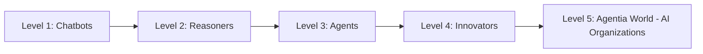

- **Now:** Industry is between Levels 2 & 3.
- **Next:** Level 4 Innovators drive breakthroughs in invention and strategy.
- **End Goal:** Level 5 Agentia World — a network of AI organizations collaborating at global scale.

### 6.6 Why the DACA Framework is Critical

The **DACA Framework** (Distributed, Autonomous, Composable, Adaptable) provides the **infrastructure blueprint** for Agentia World.

| **DACA Pillar** | **Role in Agentia World**                                               |
| --------------- | ----------------------------------------------------------------------- |
| **Distributed** | Agents operate across global networks, sharing workloads intelligently. |
| **Autonomous**  | Minimal human oversight for day-to-day execution.                       |
| **Composable**  | Agents can be rapidly assembled into task forces.                       |
| **Adaptable**   | Agents evolve capabilities as environments change.                      |

### 6.7 Real-World Example Scenario

Imagine a **global climate research mission**:

1. **Scientific Agents** analyze satellite imagery for deforestation patterns.
2. **Policy Agents** draft international policy recommendations.
3. **Engineering Agents** design renewable energy infrastructure.
4. **Logistics Agents** coordinate the deployment of equipment.
5. **Public Communication Agents** handle outreach and awareness campaigns.

**Outcome:** A coordinated, end-to-end operation — achieved without a central human project manager, but aligned to human-defined goals.

## 7. The DACA Framework — Infrastructure for a Planet of Agents

The **DACA Framework** (Distributed, Autonomous, Composable, Adaptable) is the **foundational design pattern** for building, scaling, and maintaining the Agentia World ecosystem.
It’s not just a set of tools — it’s an **AI-first architectural philosophy** designed to handle the complexity, scale, and adaptability required for a fully agentic planet.

### 7.1 Why We Need DACA

Current AI deployments face **three big bottlenecks**:

1. **Siloed AI Systems** – Agents can’t easily collaborate across domains.
2. **Limited Scalability** – Performance collapses under high concurrency.
3. **Rigid Architectures** – Difficult to upgrade or reconfigure for new use cases.

**DACA** solves these by treating agents as **modular, self-contained units** that can interconnect and adapt dynamically, no matter the platform or workload.

### 7.2 The Four Pillars of DACA

| **Pillar**      | **Definition**                                                        | **Why It Matters**                                                                            | **Example**                                                                                    |
| --------------- | --------------------------------------------------------------------- | --------------------------------------------------------------------------------------------- | ---------------------------------------------------------------------------------------------- |
| **Distributed** | Agents run across a global, multi-cloud, multi-device mesh.           | Eliminates single points of failure, improves responsiveness, enables location-aware actions. | A fleet of delivery drones coordinated by regional AI hubs.                                    |
| **Autonomous**  | Agents make decisions and execute tasks without direct human control. | Reduces operational overhead, enables 24/7 operation.                                         | An AI cybersecurity agent detecting and neutralizing threats in real time.                     |
| **Composable**  | Agents can be assembled into larger workflows on demand.              | Enables rapid creation of multi-agent task forces for complex goals.                          | Disaster relief agents combining weather analysis, logistics, and medical supply chain agents. |
| **Adaptable**   | Agents evolve, re-train, and reconfigure to meet changing conditions. | Future-proofs the ecosystem and keeps it relevant.                                            | An urban traffic agent adapting routes for a city hosting the Olympics.                        |

### 7.3 DACA’s Layered Architecture

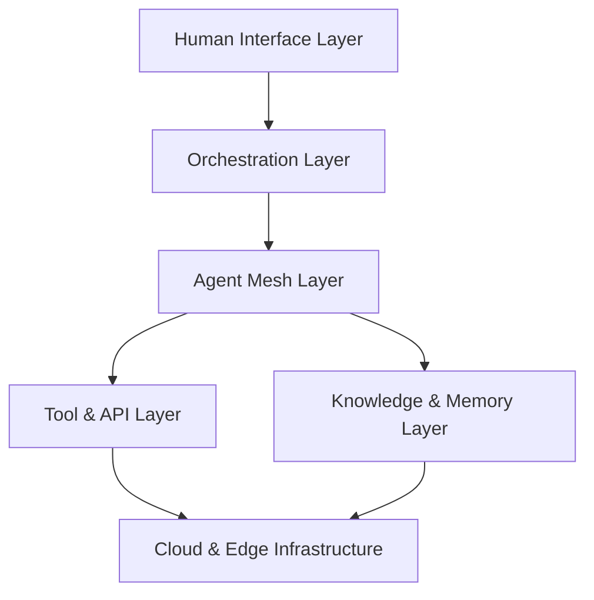

**Layers Explained:**

- **Human Interface Layer** – Voice, chat, AR/VR, or API endpoints where humans set goals.
- **Orchestration Layer** – Manages workflows, assigns tasks to agents, and monitors progress.
- **Agent Mesh Layer** – The network of DACA-compliant agents that can discover and collaborate.
- **Tool & API Layer** – External services, APIs, and hardware integrations accessible via tool calling.
- **Knowledge & Memory Layer** – Persistent context, long-term memory, and shared knowledge bases.
- **Cloud & Edge Infrastructure** – Distributed compute fabric spanning clouds, devices, and edge nodes.

### 7.4 Tool Calling in the DACA World

In DACA, **tool calling** becomes **first-class infrastructure**, not an afterthought.

- Agents can dynamically discover new tools at runtime.
- Tools can be versioned, shared, and governed across the network.
- Policies can define **who** can call **what** tool, **when**, and **under what conditions**.

**Example:**
A disaster response agent may **dynamically gain access** to a real-time drone fleet API **only when a verified emergency alert is triggered**.

### 7.5 Inter-Agent Communication (A2A Protocol)

For Agentia World to function, agents must **talk to each other** fluently:

- **Standardized message format** for requests, responses, and status updates.
- **Negotiation capabilities** so agents can delegate or trade responsibilities.
- **Security & trust layers** to verify identity and prevent malicious behavior.

### 7.6 Why DACA is More Than Technology

DACA isn’t just a tech spec — it’s a **deployment philosophy**:

- **Cloud-First** – Elastic, scalable, globally available.
- **AI-First** – Designed for reasoning and decision-making, not just automation.
- **Human-Centric** – Agents remain aligned with human values and oversight.
- **Portable** – Deployable across public clouds, private data centers, and edge devices.

### 7.7 A Practical Analogy

Think of DACA as **the Internet of Agents**:

- The Internet connected **computers**.
- DACA connects **autonomous AI agents**.

Where the Internet needed protocols like TCP/IP and HTTP, DACA provides **the “Agent Protocol Stack”** — enabling communication, collaboration, and coordination at a planetary scale.

## 8. How DACA Solves the Grand Challenge

The **Grand Challenge** of Agentia World is to design AI agents that can operate reliably for **tens of millions of concurrent users** — without breaking under load or bankrupting the operators.
DACA directly addresses this challenge through its **four pillars** and layered architecture.

### 8.1 Challenge vs. Solution Mapping

| **Challenge**                | **Why It’s Hard**                                                            | **How DACA Solves It**                                                                                                  |
| ---------------------------- | ---------------------------------------------------------------------------- | ----------------------------------------------------------------------------------------------------------------------- |
| **Planet-Scale Concurrency** | Traditional monolithic AI deployments bottleneck under high request volumes. | **Distributed** – DACA’s multi-cloud and edge mesh spreads workloads globally, keeping latency low and throughput high. |
| **Real-Time Responsiveness** | High network and compute demand slow down decision-making.                   | **Edge Compute Integration** – Critical inference runs closer to the user, reducing round-trip times.                   |
| **Cost Efficiency**          | Cloud compute costs can spiral with scale.                                   | **Composable Agents** – Agents are activated only when needed; idle agents consume no resources.                        |
| **Complex Integration**      | Diverse APIs, data formats, and protocols cause friction.                    | **Tool Calling as a Service** – Agents discover and use tools dynamically with standardized interfaces.                 |
| **Resilience**               | A single failed component can take down the system.                          | **Self-Healing Mesh** – Agents reroute tasks automatically around failed nodes or services.                             |
| **Adaptability**             | Static workflows become obsolete quickly in changing environments.           | **Adaptable Agents** – Agents can re-train, reconfigure, and evolve their capabilities without downtime.                |

### 8.2 Performance Engineering Principles in DACA

1. **Load-Aware Orchestration**
   The orchestration layer continuously monitors system load and rebalances agent tasks across regions and cloud providers.

2. **Dynamic Resource Scaling**
   Auto-scaling policies add or remove compute nodes in response to traffic spikes.

3. **Task Decomposition**
   Large problems are broken into smaller subtasks, distributed across specialized agents for parallel completion.

4. **Zero-Downtime Updates**
   Agents can be updated in place without interrupting ongoing workflows.

### 8.3 A Day in the Life of a DACA Agent Network

Imagine a **global climate monitoring initiative**:

- **Morning:** Edge-deployed agents in coastal regions detect unusual ocean temperature patterns.
- **Midday:** Orchestration layer assembles a temporary multi-agent task force — pulling in satellite imagery tools, weather prediction APIs, and logistics planning agents.
- **Afternoon:** Agents collaborate across continents to prepare an early warning and coordinate emergency supply chains.
- **Evening:** The entire task force dissolves automatically, freeing resources until the next trigger event.

All of this happens **without human intervention** — but with full **human oversight and override controls**.

### 8.4 Why This Approach Scales

- **From 100 users to 100 million** – DACA’s architecture is elastic by design.
- **From one agent to thousands** – The agent mesh grows organically without a single integration rewrite.
- **From today’s needs to tomorrow’s unknowns** – Adaptability ensures DACA doesn’t become obsolete as new challenges emerge.

With DACA addressing the operational backbone, our next step is to outline **how we actually build this future** — a practical roadmap from today’s AI tools to the **full Agentia World** vision.

## 9. Vertical vs Horizontal AI Solutions

AI solutions generally fall into two categories: **horizontal** (broad, general-purpose) and **vertical** (specialized, industry-focused).

### 9.1 Horizontal AI Solutions

- **Definition:** AI systems built for broad, cross-industry use cases.
- **Examples:** General chatbots, generic LLM interfaces, document summarizers.
- **Pros:**

  - Wide applicability
  - Rapid deployment across sectors

- **Cons:**

  - Limited domain depth
  - Outputs can be generic or lack industry context

### 9.2 Vertical AI Solutions

- **Definition:** AI systems designed for a specific industry or niche, integrating deep domain expertise.
- **Examples:**

  - Logistics route optimization agents
  - Healthcare triage automation agents
  - Retail inventory management agents
  - Construction compliance monitoring agents

- **Pros:**

  - Highly tailored to industry needs
  - Delivers measurable ROI
  - Commands premium pricing

- **Cons:**

  - Narrower scope; requires customization

### 9.3 Why DACA Focuses on Vertical Agents

- **Deeper Value:** Industry-specific logic via **OpenAI SDK**, **MCP**, and **A2A protocol**.
- **Scalability:** Cloud-native deployments fine-tuned for the vertical’s scale.
- **Monetization:** Niche expertise allows for higher subscription and usage fees.

### 9.4 Comparison Table

| Feature              | Horizontal AI              | Vertical AI                     |
| -------------------- | -------------------------- | ------------------------------- |
| **Scope**            | Broad, cross-industry      | Industry-specific               |
| **Deployment Speed** | Fast                       | Moderate                        |
| **Customization**    | Minimal                    | High                            |
| **Domain Expertise** | Low to medium              | Deep                            |
| **ROI**              | General productivity gains | High, measurable impact         |
| **Pricing Power**    | Lower (commodity market)   | Higher (specialized market)     |
| **Retention**        | Lower                      | Higher due to integration depth |

### 9.5 Visual Comparison

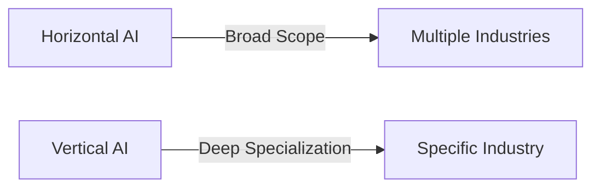

## 10. Monetization of Vertical Agents

### 10.1 Why Vertical Agents Monetize Better

Vertical agents excel because they **solve high-value, industry-specific problems** that customers are willing to pay a premium for. Their **deep integration** into workflows makes them harder to replace, increasing retention and lifetime value.

### 10.2 Revenue Models

1. **Subscription Pricing** – Monthly or annual plans based on seat count, usage, or features.
2. **Usage-Based Pricing** – Pay-per-action or pay-per-transaction (e.g., \$1 per optimized delivery route).
3. **Hybrid Models** – Base subscription plus transaction fees.
4. **Performance-Based** – Pricing tied to measurable outcomes (e.g., percentage of cost savings).

### 10.3 Industry Examples & Pricing Potential

| Industry         | Use Case                             | Example Pricing   | Notes                                                                   |
| ---------------- | ------------------------------------ | ----------------- | ----------------------------------------------------------------------- |
| **Logistics**    | Route optimization, fleet management | \$10K/month       | Comparable to SaaS like FourKites; cost savings justify premium pricing |
| **Healthcare**   | Patient triage automation            | \$5/patient/month | Scales across large hospital networks                                   |
| **Retail**       | Inventory management automation      | \$2K/month/store  | Similar to Toast’s restaurant pricing                                   |
| **Construction** | Compliance & safety monitoring       | \$15K/month/site  | Comparable to Procore’s project management suite                        |

### 10.4 Why Vertical Outperforms Horizontal

- **Targeted Value:** Solves niche pain points that general-purpose AI cannot address effectively.
- **Premium Pricing:** Customers are willing to pay more for solutions that directly impact revenue or compliance.
- **Recurring Revenue:** Embedded into daily operations, making churn less likely.
- **Lower Competition:** Niche markets often have fewer players, allowing dominance.
- **Retention & Lock-in:** Deep integrations create switching costs, similar to vertical SaaS products.

### 10.5 Market Evidence from Vertical SaaS

- **Toast (Restaurants):** Outperformed generic POS platforms by tailoring to restaurant operations.
- **ServiceTitan (Home Services):** Dominates HVAC/plumbing contractor market with specialized workflows.
- **Procore (Construction):** \$7B valuation due to industry-specific project management tools.
- **Mindbody (Fitness):** Commands higher retention rates by focusing on fitness/wellness businesses.

### 10.6 Visual – Monetization Advantage

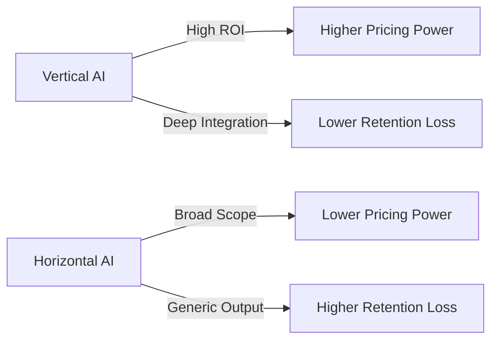

## 11. The Global AI Race

### 11.1 AI as a Strategic Asset

Artificial Intelligence is no longer just a technological advantage — it’s a **national power lever**. Countries that lead in AI are poised to dominate in **economic growth, defense capabilities, and global influence**.

AI is projected to contribute **\$15.7 trillion** to the global GDP by 2030 (_Source: PwC, Gartner_), making it one of the most valuable economic opportunities in history.

### 11.2 Current Global Leaders

- **United States** – Dominates in commercial AI innovation, big tech R\&D, and startup ecosystems.
- **China** – Leads in AI deployment scale, government-backed projects, and AI-driven infrastructure.
- **Emerging Leaders** – UK, Israel, India are rapidly scaling research and industry adoption.
- **Ambitious Entrants** – Saudi Arabia announced a **\$100B AI project** to rival the UAE’s efforts in becoming an AI hub.

### 11.3 Why This Race Matters

1. **Economic Competitiveness** – AI-driven automation, optimization, and innovation can shift global trade balances.
2. **National Security** – AI in defense, cyberwarfare, and intelligence offers decisive advantages.
3. **Technological Sovereignty** – Control over AI infrastructure reduces reliance on foreign providers.
4. **Societal Impact** – AI influences education, healthcare, governance, and public policy at scale.

### 11.4 Implications for the Workforce

- **High Demand**: AI skills — especially in agentic AI, robotics, and cloud-native AI — are in short supply.
- **Premium Salaries**: Many AI roles command **\$150K–\$200K+** annually.
- **Massive Openings**: Over **1.2 million Python-related jobs** are listed globally on LinkedIn.

### 11.5 Call-to-Action for Innovators

- **Invest in AI capabilities now** — waiting risks losing competitive ground.
- **Adopt agentic AI early** — position products and services for the autonomy-driven economy.
- **Build cross-border partnerships** — accelerate development through knowledge and resource sharing.

### 11.6 Visual – Geopolitical AI Landscape

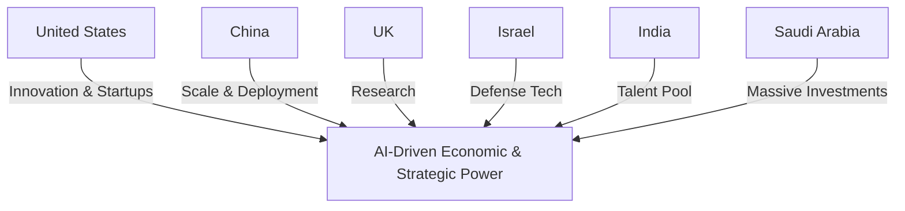

## 12. The One-Person Unicorn Concept

### 12.1 What Is a One-Person Unicorn?

Traditionally, building a billion-dollar company (_a “unicorn”_) required large teams, deep pockets, and years of development.
In the **Agentic AI era**, a **single founder** can orchestrate a high-impact, scalable business with minimal human staff — leveraging AI agents for everything from product development to marketing, operations, and customer service.

### 12.2 Why It’s Possible Now

1. **Agentic Autonomy** – AI agents can act as full-time employees, handling complex tasks end-to-end.
2. **Cloud Scalability** – Serverless and containerized infrastructure scales usage instantly without hiring more people.
3. **Global Reach** – Digital products can be launched to a worldwide audience from day one.
4. **Low Overhead** – Many AI and cloud platforms offer free tiers or pay-as-you-go pricing.
5. **No-Code & API Ecosystem** – Founders can integrate sophisticated capabilities without deep engineering teams.

### 12.3 Example Structure of a One-Person Unicorn

- **Founder Role:** Vision, strategy, and creative direction.
- **AI Agent Team:**

  - _Product Development Agent_ – builds and tests features.
  - _Marketing Agent_ – runs campaigns, manages SEO, and social media.
  - _Sales Agent_ – automates outreach, lead nurturing, and deal closing.
  - _Customer Support Agent_ – handles service requests and FAQs 24/7.
  - _Operations Agent_ – manages logistics, billing, and compliance.

### 12.4 Potential Use Cases

| Sector         | Example Product                         | Scaling Potential                              |
| -------------- | --------------------------------------- | ---------------------------------------------- |
| **EdTech**     | Personalized AI tutor                   | Millions of students globally                  |
| **Healthcare** | AI patient intake & triage tool         | Hospitals, clinics worldwide                   |
| **Finance**    | AI-driven investment research platform  | High-value subscription base                   |
| **E-commerce** | Automated dropshipping management agent | International reach with no physical inventory |

### 12.5 Why This Matters

This shift democratizes entrepreneurship. The barrier to entry for creating high-value, scalable businesses is now **imagination and execution speed**, not access to large teams or VC funding.

### 12.6 Visual – One-Person Unicorn Structure

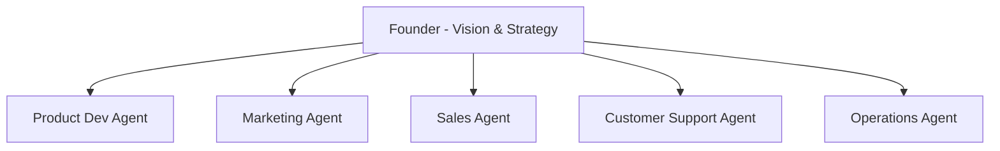

## 13. Call to Action

### 13.1 Embrace the Agentic Future

We are standing at the dawn of the **Agentic AI era**, a technological shift as profound as the internet and mobile revolutions combined.
Those who **act now** will shape the industries, economies, and societies of the next decade. Those who hesitate will be disrupted by those who didn’t.

### 13.2 Strategic Directives

1. **Adopt AI-First Thinking** – Treat AI agents as core business drivers, not optional add-ons.
2. **Invest in Vertical Specialization** – Identify your niche and build deep domain expertise into your agents.
3. **Leverage DACA Principles** – Ensure scalability, resilience, and portability from day one.
4. **Upskill Relentlessly** – Learn the tools, frameworks, and architectures that power agentic systems.
5. **Collaborate & Contribute** – Join open-source and professional AI communities to accelerate innovation.

### 13.3 The Leadership Imperative

Bold, **audacious leadership** will define who wins in the Agentic AI revolution.
Leaders must not only understand AI’s potential but be willing to **rethink business models, challenge old assumptions, and pioneer new markets**.

### 13.4 Your Next Step

- **If you’re a builder:** Start a prototype agent today.
- **If you’re an executive:** Fund a vertical agent initiative in your organization.
- **If you’re a policymaker:** Create frameworks that encourage responsible AI adoption.

> **The world will soon run on AI agents. Make sure some of them have your name on them.**

## 14. Resources

### 14.1 Key Links

- **Official Presentation** – [View the full presentation here](https://docs.google.com/presentation/d/1VNFGsCYMDT1VTe8W1wxFbmAwYsJ1I0Y-6CnTvuCEn98/edit)
- **Detailed Curriculum** – [Access the complete syllabus for mastering AI and agentic systems](https://docs.google.com/document/d/1BygAckkfc_NFQnTfEM6qqUvPdlIHpNItmRtvfRMGp38/edit?tab=t.0)

### 14.2 Tools & Frameworks Mentioned

- **OpenAI Agents SDK** – Build reasoning-driven, autonomous AI agents.
- **Dapr** – Distributed application runtime for resilient microservices.
- **A2A Protocol** – Standard for agent-to-agent communication.
- **MCP** – Standardized model integration and tool calling.
- **Kubernetes & Helm** – Container orchestration and automated deployment.

### 14.3 Additional References & Links

- [Chatbot Arena LLM Leaderboard – Community-driven Evaluation for Best LLMs](https://huggingface.co/spaces/lmarena-ai/chatbot-arena-leaderboard)
- [Generative AI: A Three-Year Revolution – ChatGPT vs Grok AI vs Gemini AI](https://www.peppercontent.io/blog/chatgpt-vs-grok-ai-vs-gemini-ai-everything-you-need-to-know-about-these-powerful-ai-assistants/)
- [Gartner: 2025 Top Technology Trends](https://www.gartner.com/en/articles/top-technology-trends-2025)
- [AI Agents Market Size Statistics](https://www.sellerscommerce.com/blog/ai-agents-statistics/)
- [The Global AI Race – All Tech Magazine](https://alltechmagazine.com/the-global-ai-race/)
- [GitHub Octoverse 2024 – Top Programming Languages](https://github.blog/news-insights/octoverse/octoverse-2024/)
- [YouTube: Growth in Docker File Usage & AI-based Cloud Native Workloads](https://www.youtube.com/watch?v=b5Ho2_Si6hY)

### 14.4 Suggested Next Reads

- _Artificial Intelligence: A Guide for Thinking Humans_ – Melanie Mitchell
- _Architects of Intelligence_ – Martin Ford
- _The Fourth Industrial Revolution_ – Klaus Schwab

---
