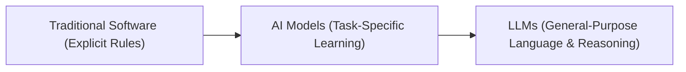

# Traditional Software, AI Models, and LLMs

## 1. Traditional Software

**Definition:** Programs written with explicit rules. The computer does exactly what you tell it.

**Example:**

```python
# Traditional software: deterministic rule-based logic
def add_numbers(a, b):
    return a + b

print(add_numbers(5, 7))  # Output: 12
```

## 2. AI Models (Non-LLM)

**Definition:** Programs that **learn patterns from data** to make predictions — usually specialized for one task.
Often, we **import** the model from a library or service and don’t see the underlying code.

**Example (Spam Detection with Pretrained Model):**

```python
# Imagine this is a pre-trained spam detection model from an external package.
# We just import it and use it — we don't know how it's implemented internally.

from spam_detector import is_spam  # Pretend this comes from a library

# Use the model
print(is_spam("You have won a free prize!"))        # Output: True
print(is_spam("Let's meet for lunch tomorrow."))    # Output: False
```

**What’s happening:**

- In real life, `spam_detector` could be:

  - A Python library with a trained ML model.
  - An API client that sends your text to a remote model.

- You **don’t see the internal rules** — the model learned them from data during training.

**Key point:** With AI models, you use the function as-is, without manually coding the rules yourself.

## 3. LLMs (Large Language Models)

**Definition:** AI models trained on massive amounts of text to understand and generate human-like language.

**Simplest Example:**

```python
from openai import OpenAI

# Direct API key (for demo purposes only — later we’ll store it securely)
client = OpenAI(api_key="your_api_key_here")

response = client.chat.completions.create(
    model="gpt-3.5-turbo",  # beginner-friendly, widely used
    messages=[
        {"role": "user", "content": "What is 5 plus 7?"}
    ]
)

print(response.choices[0].message.content.strip())
```

With the same LLM, you can:

- Do math
- Write a poem
- Explain a concept in simple words

## Comparison Table

| Feature / Behavior | Traditional Software      | AI Models (Non-LLM)        | LLM Models                         |
| ------------------ | ------------------------- | -------------------------- | ---------------------------------- |
| **Logic Source**   | Explicit rules            | Learned from specific data | Learned from massive text datasets |
| **Adaptability**   | None without code changes | Limited to one task        | High — adapts via prompts          |
| **Input Type**     | Structured only           | Structured/domain-specific | Natural language or structured     |
| **Output Type**    | Fixed formats only        | Fixed predictions          | Flexible: text, code, reasoning    |

## Evolution Diagram



## When to Use Each

- **Traditional Software:** Banking systems, data pipelines, exact calculations.
- **AI Models:** Spam detection, image classification, speech recognition.
- **LLMs:** Summarization, answering questions, reasoning across multiple domains.
