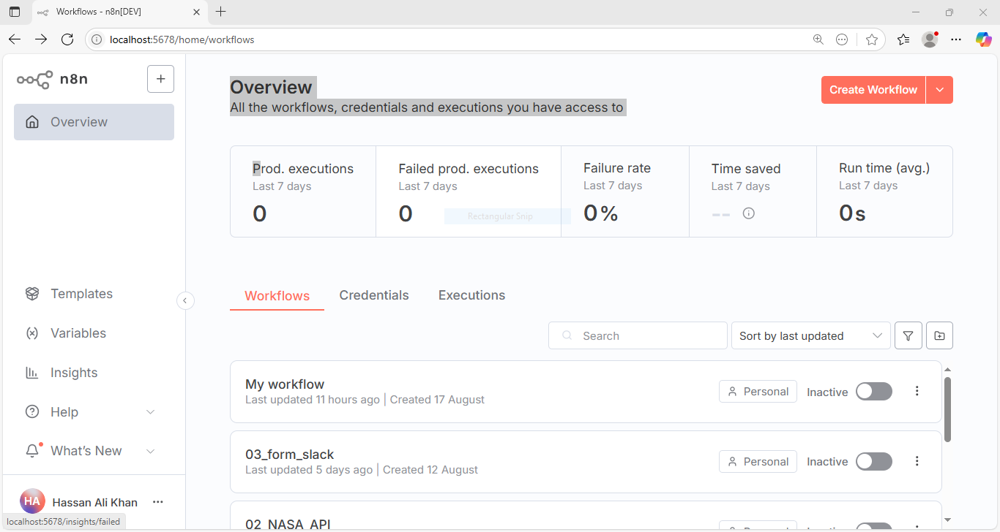
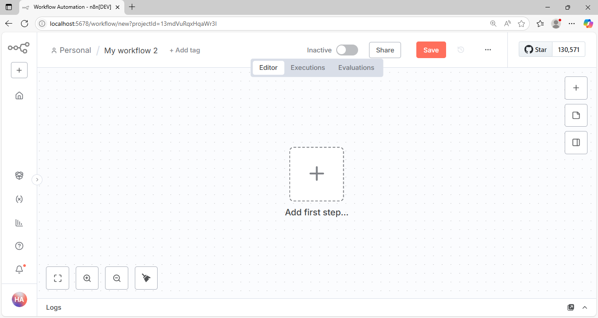
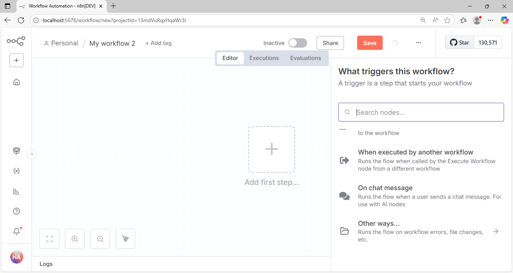
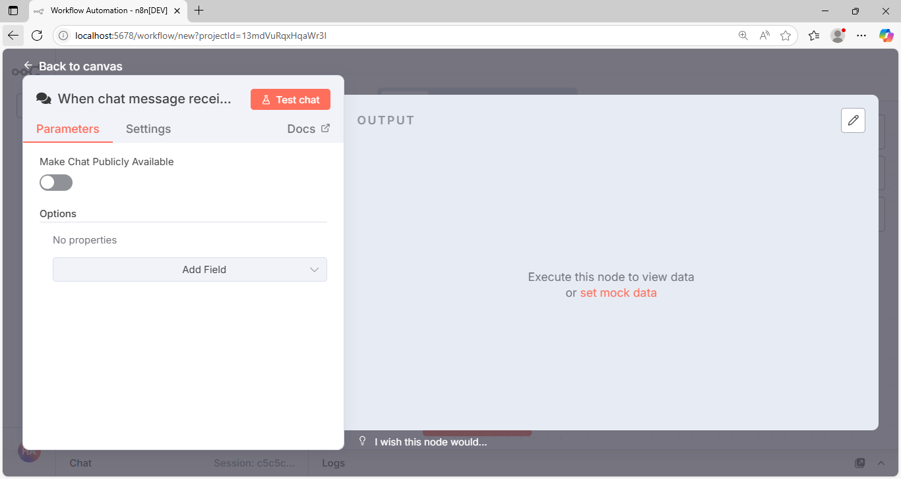
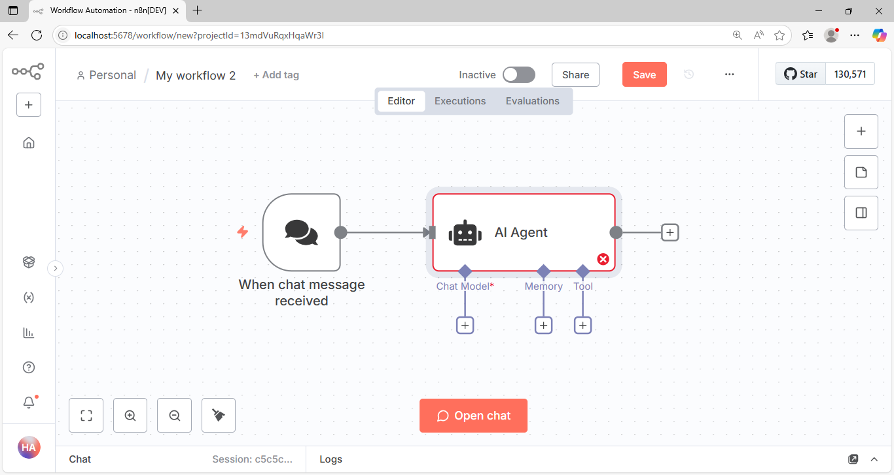
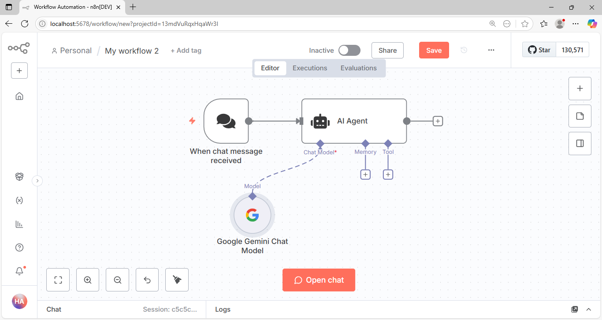
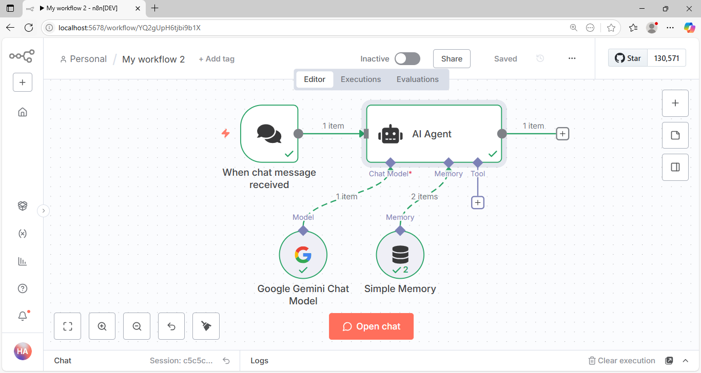

# n8n Platform

## Overview

[n8n](https://n8n.io) is a **workflow automation platform** that allows you to connect different apps and services with customizable logic, without needing to write extensive code. It enables users to automate repetitive tasks, orchestrate data flows, and integrate APIs in a **low-code / no-code** environment.

Unlike many other automation tools, n8n is **open-source**, giving you full control and flexibility to host it yourself, extend functionality, and avoid vendor lock-in.

## How to Use n8n

n8n can be used in three main ways:

- **n8n Cloud** – A fully managed service hosted by the n8n team.
- **Docker** – Run n8n in a containerized environment for flexibility and scalability.
- **Local Mode** – Run n8n directly on your own system for testing and development.

> In this guide, we are going to follow the **Local Mode** approach to explore and understand n8n.

## Installation

To get started with n8n in **Local Mode**, you need to set it up on your system.

### Step 1: Install Node.js

- Download Node.js **version 22 (LTS)** from the official website: [https://nodejs.org](https://nodejs.org)
- Install it on your system (Windows, macOS, or Linux).

### Step 2: Verify Installation

Open your terminal and check the installed versions:

```bash
node -v
```

Expected output:

```
v22.0.0
```

```bash
npm -v
```

Example output:

```
10.5.0
```

### Step 3: Install n8n

Once Node.js and npm are ready, install n8n globally:

```bash
npm install n8n -g
```

After installation, check the installed n8n version:

```bash
n8n -v
```

Example output:

```
1.64.0
```

> Note: The exact version numbers you see (`node`, `npm`, and `n8n`) may differ depending on when and how you install them.

## Starting n8n

Once installed, you can start n8n with the following command:

```bash
n8n start
```

- Open your browser and navigate to [http://localhost:5678](http://localhost:5678).
- On your **first visit**, n8n will prompt you to **log in**.
- If you don’t already have an account, you can **sign up** directly from this page.
- Once successfully logged in or registered, you will be redirected to the **n8n platform dashboard**.

The dashboard provides access to all your workflows and tools to manage automation.

👉 Refer to the image below for a reference view of the n8n interface:



If you are using n8n for the first time, you will see an option to **create a workflow**.
If workflows have already been created, a **list of existing workflows** will also be displayed on the platform.

## 🛠️ Creating Your First Agentic Workflow

Follow these steps to create your first **agentic workflow** in n8n:

### Step 1: Start a New Workflow

- From the **n8n platform dashboard**, click on **“New Workflow”**.
- A blank workflow canvas will open where you can add nodes.
- You will be expecting a screen as shared in the image below:

    

### Step 2: Add a Trigger Node

- Every workflow begins with a **trigger**. Click **“Add your first step”** to select the trigger node.
- Choose a trigger node **“On Chat Message”** – this will start the workflow whenever a new chat message is received.

  

- Once it is selected, a screen will open showing the **properties and configuration** of this node.

  

- Close the popup window, and you will see the node added to the screen on the **canvas**.

  

### Step 3: Add an AI Agent Node

- After adding the trigger, click on the **plus (+) button** next to the trigger node to add a new step.
- From the list of available nodes, select **“AI Agent”**.
- This node represents an **AI Agent** that will later be connected to a model for reasoning and responses.
- Once selected, a screen will open showing the **properties and configuration** of the node.
- Close the popup window, and you will see the **AI Agent node** added to the workflow canvas, connected to the trigger.

  

### Step 4: Get Gemini API Key

- As we are going to use the **Gemini model as our LLM (Large Language Model)**, getting the API key is necessary.
- Go to the official [Google AI Studio](https://aistudio.google.com/) website.
- Sign in with your Google account.
- Navigate to the **API Keys** section and generate a new API key.
- Copy the generated key — you will need it in the next step when adding Gemini to the workflow.

### Step 5: Add Gemini Model

- In the **AI Agent node** on the canvas, click the **plus (+) button** under **Chat Model**.
- From the available nodes, select **Google Gemini Chat Model**.
- A configuration screen will open with parameter options.

In the parameters section:

1. Under **Credential to connect with**, select **“Create New Credentials”**.
2. In the credential setup, paste your **Gemini API Key** (copied earlier from Google AI Studio).
3. From the **Model** dropdown list, select the **Gemini model** you want to use (for example, `gemini-pro`).

- Once done, close the popup window, and the **Google Gemini Chat Model node** will appear on the canvas, connected to the AI Agent.

    

### Step 6: Execute and Test the Workflow

* Once the **Trigger**, **AI Agent**, and **Gemini Model** nodes are connected, click the **Save** button at the top.
* To test the workflow, click on **Execute Workflow**.
* On the workflow canvas, click the **Open Chat** button.

  * A **chat window** will open where you can send and receive messages.
  * The messages you send here will act as inputs to the workflow.
* The message will be received by the **AI Agent**, which will then forward it to the **Google Gemini Chat Model**.
* Gemini will process the input and return a **generated response**, which will appear in the chat window as well as in the execution results panel.
* If everything is working correctly, you will see the workflow execute successfully with the Gemini output included.

### Step 7: Add Memory

* In the **AI Agent node** on the canvas, click the **plus (+) button** under **Memory**.
* From the list of available nodes, select **“Simple Memory”**.
* The **Simple Memory** node allows the agent to **retain context** across multiple messages in the same chat session.
* Without memory, the AI Agent treats each new message as an isolated query. With memory, the agent can remember what was said earlier and respond more naturally.

💡 **Example:**

* Without memory:

  * You: *“Who is Albert Einstein?”*
  * Agent: *“Albert Einstein was a theoretical physicist…”*
  * You: *“When was he born?”*
  * Agent: *“I don’t know who you’re talking about.”*

* With **Simple Memory**:

  * You: *“Who is Albert Einstein?”*
  * Agent: *“Albert Einstein was a theoretical physicist…”*
  * You: *“When was he born?”*
  * Agent: *“He was born on March 14, 1879.”*

- After selecting **Simple Memory**, close the popup window, and it will be connected to the AI Agent on the canvas.

### Step 8: Final Workflow

* After adding all the required nodes (**Trigger → AI Agent → Google Gemini Chat Model → Simple Memory**), your workflow canvas should look like the diagram below:

    

🎉 Congratulations! You have successfully built your **first agentic workflow with n8n**.
This workflow is now capable of receiving chat messages, processing them through an AI Agent powered by **Gemini**, and maintaining context with **Simple Memory**.