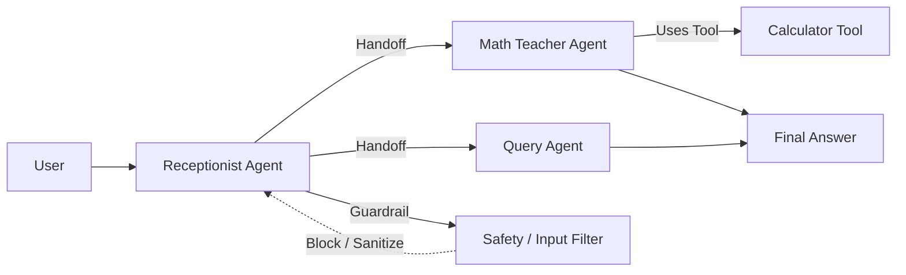
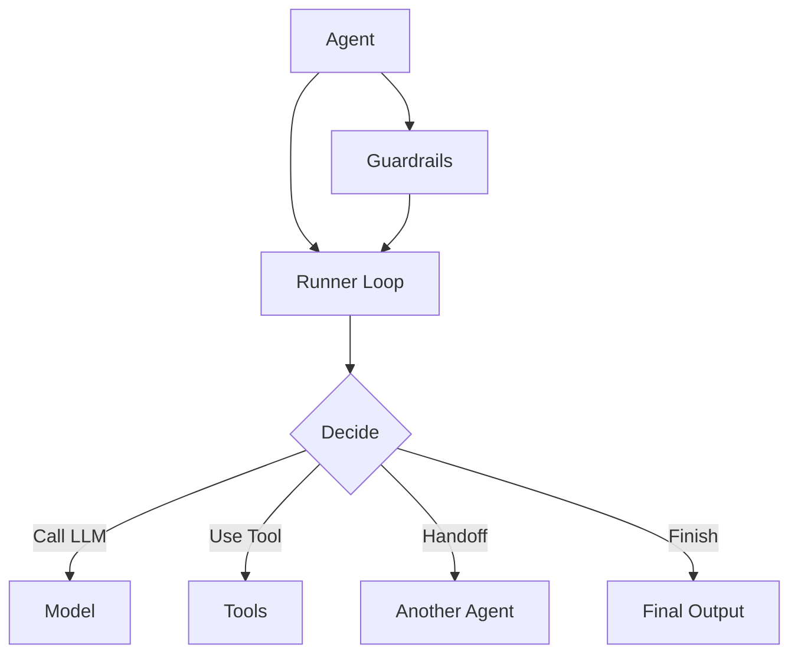

# Getting Started with OpenAI Agents SDK

> Build smart, tool-using AI assistants (single- or multi-agent) in **Python** with minimal boilerplate.

## What is the OpenAI Agents SDK?

The **OpenAI Agents SDK** is an open-source, lightweight, Python-first toolkit for building **agentic** applications — systems where one or more AI **agents** can reason, use tools, hand off tasks to other agents, and operate under **guardrails** with **tracing/observability**.

* Docs: [https://openai.github.io/openai-agents-python/](https://openai.github.io/openai-agents-python/)
* Repo: [https://github.com/openai/openai-agents-python](https://github.com/openai/openai-agents-python)

## Simple Analogy (School)

* **Student (User)** asks a question.
* **Receptionist Agent** reads it and decides what to do.
* If it’s math, the receptionist **hands off** to the **Math Teacher Agent**.
* The teacher might use a **Tool** (e.g., calculator).
* A **Guardrail** blocks naughty or unsafe requests.
* **Tracing** records what happened, step by step.



## Core Concepts — The Power of Simple Primitives

The Agents SDK is built around a few simple but powerful ideas:

* **Agent**: An LLM with **instructions**, optional **tools**, and optional **guardrails**.
* **Tool**: A callable capability (e.g., calculator, web search, file lookup) the agent may choose to use.
* **Handoff**: An agent delegates part/all of a task to another, more specialized agent.
* **Guardrail**: Validates or filters inputs/outputs for safety and policy compliance.
* **Runner**: Executes the agent loop (think → decide → act) and returns the final output with trace.
* **Tracing**: Records decisions, tool calls, and handoffs so you can debug and improve workflows.



> Start with one agent and one tool, then scale to multi-agent workflows with handoffs and guardrails.

## Hello World (Single Agent)

```python
# Minimal "Hello World" using the Agents SDK
from agents import Agent, Runner

agent = Agent(name="Assistant", instructions="You are a helpful assistant.")

result = Runner.run_sync(agent, "Write a haiku about recursion in programming.")
print(result.final_output)
```

**Sample output**

```
Code within the code,
Functions calling themselves now,
Infinite loop’s dance.
```

> The `Runner` handles the loop of “think → decide → act (use tool?) → respond”.

## Why Use the Agents SDK? (Quick Take)

* **Python-first** and **minimal abstraction** → learn fast, ship fast.
* **High control** over how agents behave and which tools they may call.
* **Built-in orchestration** (loop, tool invocation, handoffs) without heavy scaffolding.
* **Observability** via tracing so you can debug and improve behavior.

## Comparison: Where It Fits vs Other Frameworks

| Framework             | Abstraction  | Key Traits                                                                         | Learning Curve | Control       | Simplicity |
| --------------------- | ------------ | ---------------------------------------------------------------------------------- | -------------- | ------------- | ---------- |
| **OpenAI Agents SDK** | Minimal      | Python-first, core primitives (Agents, Handoffs, Guardrails), direct control       | **Low**        | **High**      | **High**   |
| CrewAI                | Moderate     | Role-based agents, crews, tasks, collaboration                                     | Low-Medium     | Medium        | Medium     |
| AutoGen               | High         | Conversational patterns, multi-agent chats, human-in-the-loop                      | Medium         | Medium        | Medium     |
| Google ADK            | Moderate     | Multi-agent hierarchies, Google Cloud integration (Gemini/Vertex), streaming       | Medium         | Med-High      | Medium     |
| LangGraph             | Low-Moderate | Graph-based workflows, nodes/edges, explicit state                                 | **Very High**  | **Very High** | Low        |
| Dapr Agents           | Moderate     | Event-driven, stateful virtual actors, Kubernetes integration, 50+ data connectors | Medium         | Med-High      | Medium     |

**Takeaway:** For most teams, **OpenAI Agents SDK** offers the best balance of **speed**, **control**, and **clarity**. Pick heavier frameworks only if you truly need their extra complexity.

## Key Features (Developer View)

* **Python-first design** — works naturally with functions & types.
* **Built-in agent loop** — prompt, decide, tool, handoff, repeat until done.
* **Interoperable** — plays well with OpenAI models/Responses API; adaptable to chat-completions-style backends.
* **Multi-agent made simple** — compose specialists with handoffs.
* **Tracing & observability** — see and debug what your agent did.