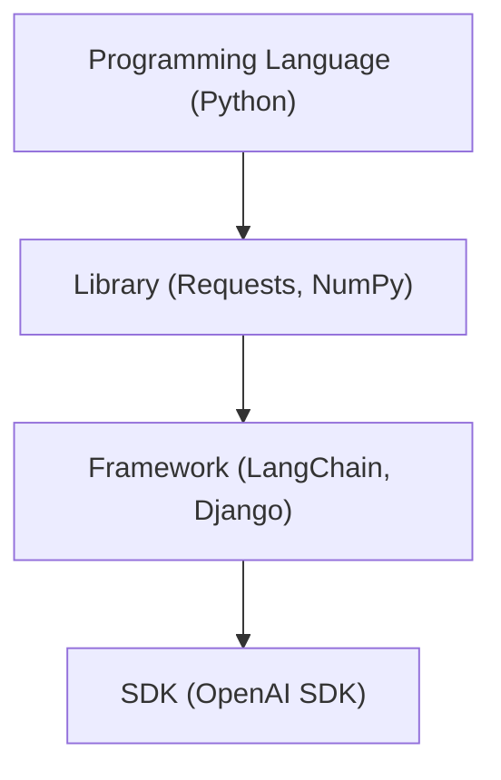

# Programming Language, Library, Framework, SDK

## Simple Analogy — Making a House

| Term                     | What It Means                                           | House Example                         | AI Example        |
| ------------------------ | ------------------------------------------------------- | ------------------------------------- | ----------------- |
| **Programming Language** | The basic way to tell the computer what to do.          | Bricks, wood, cement — raw materials. | Python            |
| **Library**              | Ready-made tools you can use when you want.             | A hammer, drill, saw.                 | Requests, NumPy   |
| **Framework**            | A fixed plan to build something — you follow its rules. | A pre-designed house layout.          | LangChain, Django |
| **SDK**                  | A special kit from a company to use _their_ services.   | IKEA kit with tools & instructions.   | OpenAI SDK        |

## Visual Flow



## 1️⃣ Programming Language — Python

A programming language is the basic way to communicate with a computer.

```python
def greet(name):
    return f"Hello, {name}!"
print(greet("Alice"))
```

## 2️⃣ Library — `requests`

A library is a collection of pre-written code you can import and use anytime.

```python
import requests
r = requests.get("https://catfact.ninja/fact")
print(r.json())
```

## 3️⃣ Framework — LangChain

A framework provides a structured way to build applications. You fit your code into its structure.

```python
from langchain.chat_models import ChatOpenAI
from langchain.prompts import ChatPromptTemplate

chat = ChatOpenAI(model="gpt-4o-mini")
prompt = ChatPromptTemplate.from_messages([
    ("system", "You are a helpful assistant."),
    ("user", "{question}")
])

print(chat.invoke(prompt.format_messages(
    question="What's the capital of France?"
)).content)
```

## 4️⃣ SDK — OpenAI SDK

An SDK (Software Development Kit) includes tools, code, and documentation to interact with a specific service.

```python
from openai import OpenAI
client = OpenAI()
res = client.chat.completions.create(
    model="gpt-4o-mini",
    messages=[{"role": "user", "content": "Tell me a cat joke"}]
)
print(res.choices[0].message.content)
```

**Summary:**

- **Programming Language** — You write all the instructions yourself.
- **Library** — You borrow ready-made tools when needed.
- **Framework** — You follow its rules and structure.
- **SDK** — A complete kit for a specific platform or service.
