# Async Programming

## What is Async Programming?

**Normal Python code (synchronous)**:  
It runs **one line at a time**. If one line takes time (like waiting for data from the internet), everything else **stops and waits**.

```mermaid
gantt
    title Synchronous Flow (5 Tasks)
    dateFormat  X
    axisFormat %Ss
    section Tasks
    Task 1 :done, t1, 0, 2s
    Task 2 :done, t2, 2, 4s
    Task 3 :done, t3, 6, 1s
    Task 4 :done, t4, 7, 5s
    Task 5 :done, t5, 12, 3s
```



**Asynchronous code**:  
It runs **multiple things at once** without stopping the whole program when something takes time.

```mermaid
gantt
    title Asynchronous Flow (5 Tasks)
    dateFormat  X
    axisFormat %Ss
    section Tasks
    Task 1 :active, t1, 0, 2s
    Task 2 :active, t2, 0, 4s
    Task 3 :active, t3, 0, 1s
    Task 4 :active, t4, 0, 5s
    Task 5 :active, t5, 0, 3s
```



## Real-Life Analogy

Imagine you're making a sandwich:

1. Toasting bread takes 3 minutes.

**Synchronous way**:
- You start toasting.
- You wait 3 minutes doing NOTHING.
- Then you cut tomatoes and cheese.
- Thenyou assemble the sandwich.

**Asynchronous way**:

- You start toasting.
- While it toasts, you cut and prep.
- Then you finish.

**Async saves time.**

## Python Keywords

In Python async programming, you’ll see these:

| Keyword   | Meaning                                                                        |
| --------- | ------------------------------------------------------------------------------ |
| `async`   | Marks a function as **asynchronous**. It can pause and resume.                 |
| `await`   | Tells Python to **wait for something**, but **don’t block** the whole program. |
| `asyncio` | A module that helps run asynchronous tasks.                                    |

## A Very Simple Example

Let’s simulate two tasks:

- Task A: waits 3 seconds
- Task B: waits 2 seconds

### Synchronous (slow version)

```python
import time

def task1():
    print("Task 1 started")
    time.sleep(3)  # wait 3 seconds
    print("Task 1 finished")

def task2():
    print("Task 2 started")
    time.sleep(2)  # wait 2 seconds
    print("Task 2 finished")

task1()
task2()
```

⏱ Total time = 3 + 2 = **5 seconds**

### Asynchronous (fast version)

```python
import asyncio

async def task1():
    print("Task 1 started")
    await asyncio.sleep(3)  # non-blocking sleep
    print("Task 1 finished")

async def task2():
    print("Task 2 started")
    await asyncio.sleep(2)
    print("Task 2 finished")

async def main():
    await asyncio.gather(task1(), task2())  # run both at the same time

asyncio.run(main())
```

⏱ Total time = **just 3 seconds**, because both tasks run **together**!

## Try it Yourself

1. Copy that async example into a Python file (e.g., `async_test.py`)
2. Run it with `python async_test.py`
3. You’ll see both tasks start instantly, and the total wait is just 3 seconds.

---

## Key Concepts to Remember

| Concept            | Meaning                                               |
| ------------------ | ----------------------------------------------------- |
| `async def`        | Makes a function "awaitable"                          |
| `await`            | Waits for async code to finish (like sleep, HTTP, DB) |
| `asyncio.sleep()`  | A fake "wait" to simulate delay (non-blocking)        |
| `asyncio.gather()` | Runs many async functions at once                     |
| `asyncio.run()`    | Starts the whole async program                        |

## Real-World Use Cases

- Web scraping many websites at the same time
- Handling multiple users in a chat app
- Downloading multiple files at once
- Talking to a database without freezing your app

---

## Try the runnable demo

There's a small project under `async-programming/` that contrasts sync vs async downloads and prints total elapsed time.

Quick run from the `async-programming/` folder:

```bash
uv run run-module
```
