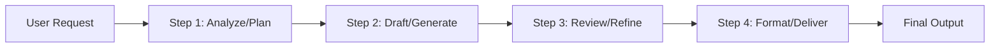
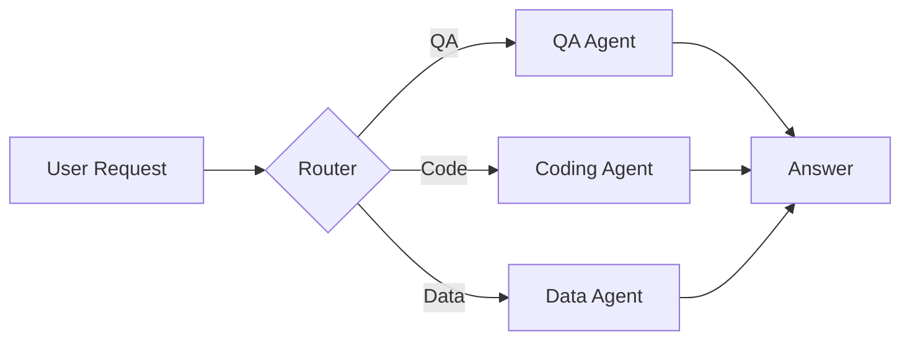
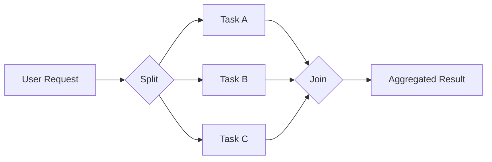
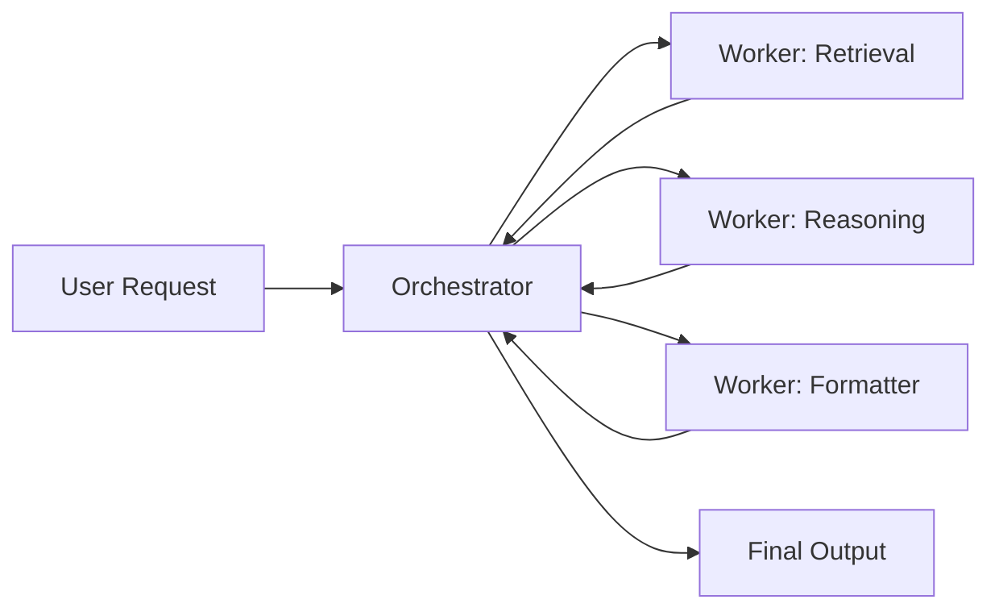
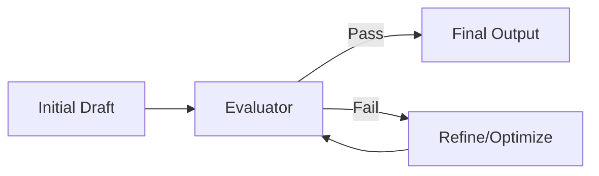

# Anthropic Design Patterns

The OpenAI Agents SDK supports common agent design patterns described by Anthropic and others. These patterns help you structure complex tasks, improve responsiveness, and keep systems maintainable.

Source/inspiration: https://www.anthropic.com/engineering/building-effective-agents

Below are five core patterns, simplified, with short explanations and flow diagrams.

## 1) Prompt Chaining (Chain Workflow)

Break a complex goal into ordered steps. Each step refines or extends prior outputs.

When to use:

- Multi-step reasoning and drafting
- ETL-like transformations (extract → clean → format)

## 2) Routing

Send the task to the most suitable specialist. A router decides which agent/tools handle the request.

When to use:

- Mixed intents (QA, coding, data lookup)
- Domain-specialized agents

## 3) Parallelization

Do independent subtasks concurrently, then merge results. Improves latency and throughput for I/O-bound work.

When to use:

- Fetch/process multiple sources
- Fan-out/fan-in pipelines

## 4) Orchestrator-Workers

One agent coordinates; specialized workers execute subtasks. Orchestrator aggregates results and returns the final answer.

When to use:

- Decomposition with heterogeneous skills
- Oversight, coordination, and aggregation

## 5) Evaluator-Optimizer (Feedback Loop)

Generate → evaluate → revise in a loop until quality passes a threshold.

When to use:

- Quality-sensitive outputs (summaries, plans, code)
- Automatic self-critique and improvement

---

Notes on SDK mapping (high level):

- Chaining: structure multi-step calls; persist context/state between steps.
- Routing: implement a “router” agent or classification step that hands off to specialized agents.
- Parallelization: fan out tasks with async/concurrency and combine results.
- Orchestrator-Workers: a coordinator agent delegates and aggregates from worker agents.
- Evaluator-Optimizer: add an evaluation step and loop until criteria are met.

These patterns are general and can be combined to fit your application.
